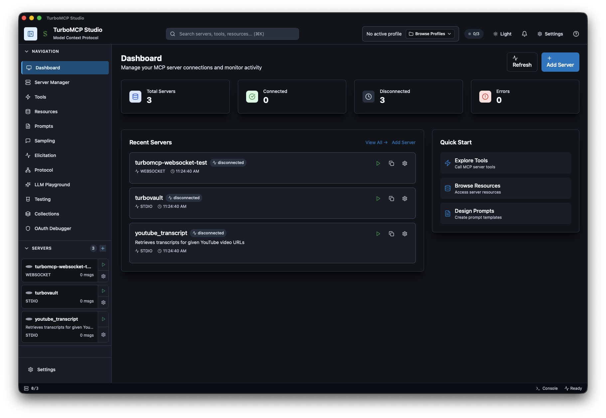
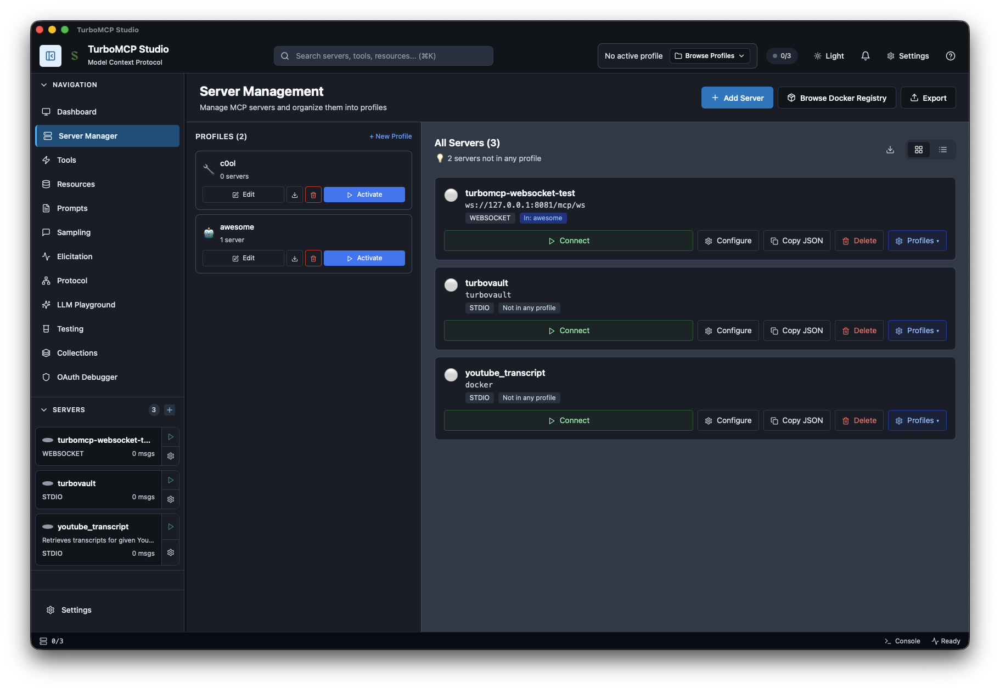

<div align="center">


# TurboMCP Studio

A native desktop application for developing, testing, and debugging Model Context Protocol servers.

[](https://github.com/Epistates/turbomcpstudio/releases)
[](LICENSE)

[Download](https://github.com/Epistates/turbomcpstudio/releases/latest) • [Documentation](#documentation) • [Contributing](CONTRIBUTING.md)

</div>

---



## Why TurboMCP Studio?

- **Native Performance** — Built with Rust and Tauri 2.0 for a fast, native desktop experience
- **Multi-Transport** — STDIO, HTTP/SSE, WebSocket, TCP, and Unix socket support out of the box
- **Protocol Inspector** — Real-time message tracing with latency tracking and filtering
- **OAuth 2.1 Built-in** — PKCE, token refresh, and provider templates for secured MCP servers
- **Sampling & Elicitation** — Human-in-the-loop approval for LLM sampling requests
- **Cross-Platform** — macOS, Windows, and Linux from a single codebase (Unix sockets on macOS/Linux, TCP/HTTP/WebSocket everywhere)
- **Developer-Friendly** — Think Postman, but for MCP servers

## Quick Start

1. **Download** the latest release for your platform
2. **Install** and launch TurboMCP Studio
3. **Connect** to your MCP server
4. **Explore** tools, resources, and prompts
5. **Test** your MCP implementation

## Features

### Server Management
- Connect to MCP servers over STDIO, HTTP/SSE, WebSocket, TCP, or Unix sockets
- Profile-based configuration with server groups and persistence
- Health monitoring with automatic reconnection and status tracking
- Rate limiting (configurable per-server) to protect upstream services



### Developer Tools
- **Tool Explorer** — Discover, inspect, and invoke MCP tools with schema validation
- **Resource Browser** — Navigate and inspect MCP resources with content preview
- **Prompt Designer** — Create and test MCP prompts with variable interpolation
- **Protocol Inspector** — Real-time message tracing with request/response correlation and latency
- **Developer Console** — Integrated logging with level filtering

### Sampling & Elicitation
- Human-in-the-loop approval flow for MCP sampling requests
- Configurable auto-approve, manual, and LLM-assisted modes
- Cost estimation and request history tracking
- Elicitation support for structured user input from MCP servers

### OAuth 2.1
- Built-in OAuth flow with PKCE (S256) support
- Provider templates for common OAuth servers
- Secure credential storage via OS keyring (macOS Keychain, Windows Credential Manager, Linux Secret Service)
- Token refresh and session management

### Workflow Engine
- Define multi-step workflows against MCP servers
- Variable interpolation across steps
- Execution history with database persistence

### Additional
- Light/dark theme with system preference detection
- Server registry browser for discovering MCP servers
- Proxy server management for MCP traffic inspection
- Collections for organizing and replaying MCP operations
- SQLite-backed local storage for history and configuration

## Installation

### Pre-built Binaries

Download the latest release for your platform from [GitHub Releases](https://github.com/Epistates/turbomcpstudio/releases/latest):

| Platform | Format |
|----------|--------|
| macOS (Apple Silicon) | `.dmg` or `.app` (signed + notarized) |
| macOS (Intel) | `.dmg` or `.app` (signed + notarized) |
| Windows | `.msi` installer |
| Linux | `.AppImage` or `.deb` |

## Building from Source

### Prerequisites

#### All Platforms
- **Node.js**: 20.x or later ([Download](https://nodejs.org/))
- **pnpm**: 9.x or later
  ```bash
  npm install -g pnpm
  ```
- **Rust**: 1.80 or later ([rustup.rs](https://rustup.rs/)) — Tauri 2.0 requires 1.77.2+
  ```bash
  curl --proto '=https' --tlsv1.2 -sSf https://sh.rustup.rs | sh
  ```

#### macOS
- **Xcode Command Line Tools**:
  ```bash
  xcode-select --install
  ```

#### Windows
- **Visual Studio Build Tools**: [Download](https://visualstudio.microsoft.com/downloads/)
  - Install "Desktop development with C++" workload
- **WebView2**: Usually pre-installed on Windows 10/11
  - If missing: [Download WebView2 Runtime](https://developer.microsoft.com/en-us/microsoft-edge/webview2/)

#### Linux (Debian/Ubuntu)
```bash
sudo apt-get update
sudo apt-get install -y \
  libwebkit2gtk-4.1-dev \
  build-essential \
  curl \
  wget \
  file \
  libxdo-dev \
  libssl-dev \
  libayatana-appindicator3-dev \
  librsvg2-dev
```

#### Linux (Fedora/RHEL)
```bash
sudo dnf install -y \
  webkit2gtk4.1-devel \
  openssl-devel \
  curl \
  wget \
  file \
  libappindicator-gtk3-devel \
  librsvg2-devel
```

### Clone the Repository

```bash
git clone https://github.com/Epistates/turbomcpstudio.git
cd turbomcpstudio
```

### Install Dependencies

```bash
# Install frontend dependencies
pnpm install
```

TurboMCP v3.0.4 is published to [crates.io](https://crates.io/crates/turbomcp-client) and fetched automatically during the build process. No additional setup required.

### Development Build

```bash
# Start development server with hot-reload
pnpm run tauri dev

# This will:
# 1. Start Vite dev server (frontend) on http://localhost:1420
# 2. Compile Rust backend
# 3. Launch desktop app with hot-reload enabled
```

### Production Build

#### Quick Build (Local Testing)

For local testing without creating installers:

```bash
# macOS: Build app bundle only (faster, no DMG)
pnpm run tauri:build

# All platforms: Build executable without installers
pnpm run tauri build -- --no-bundle

# Executable location: src-tauri/target/release/turbomcpstudio(.exe)
```

#### Platform-Specific Builds

<details>
<summary><b>macOS</b></summary>

```bash
# Build for your current architecture
pnpm run tauri build

# Build for specific architecture
pnpm run tauri build -- --target aarch64-apple-darwin  # Apple Silicon
pnpm run tauri build -- --target x86_64-apple-darwin   # Intel

# Output locations:
# - App Bundle: src-tauri/target/[arch]/release/bundle/macos/TurboMCP Studio.app
# - DMG Installer: src-tauri/target/[arch]/release/bundle/dmg/TurboMCP Studio_*.dmg
```

**Note**: Unsigned builds will show a Gatekeeper warning. To bypass:
```bash
# Right-click app → "Open" → "Open"
# Or remove quarantine attribute:
xattr -d com.apple.quarantine "TurboMCP Studio.app"
```

</details>

<details>
<summary><b>Windows</b></summary>

```bash
# Build installers (MSI and NSIS)
pnpm run tauri build

# Build MSI only
pnpm run tauri build -- --bundles msi

# Build NSIS installer only
pnpm run tauri build -- --bundles nsis

# Output locations:
# - MSI: src-tauri/target/release/bundle/msi/TurboMCP Studio_*.msi
# - NSIS: src-tauri/target/release/bundle/nsis/TurboMCP Studio_*-setup.exe
# - Executable: src-tauri/target/release/turbomcpstudio.exe
```

**Requirements**:
- MSI requires [WiX Toolset v3](https://wixtoolset.org/docs/wix3/)
- NSIS requires [NSIS](https://nsis.sourceforge.io/Download)

**Installation via Package Manager**:
```powershell
# Using Chocolatey
choco install wixtoolset nsis

# Using Scoop
scoop install wixtoolset nsis
```

</details>

<details>
<summary><b>Linux</b></summary>

```bash
# Build all Linux formats (AppImage, DEB, RPM)
pnpm run tauri build

# Build specific format
pnpm run tauri build -- --bundles appimage  # Universal format
pnpm run tauri build -- --bundles deb       # Debian/Ubuntu
pnpm run tauri build -- --bundles rpm       # Fedora/RHEL

# Output locations:
# - AppImage: src-tauri/target/release/bundle/appimage/turbomcp-studio_*.AppImage
# - DEB: src-tauri/target/release/bundle/deb/turbomcp-studio_*.deb
# - RPM: src-tauri/target/release/bundle/rpm/turbomcp-studio-*.rpm
```

**Running AppImage**:
```bash
chmod +x turbomcp-studio_*.AppImage
./turbomcp-studio_*.AppImage
```

**Installing DEB**:
```bash
sudo dpkg -i turbomcp-studio_*.deb
# If dependencies missing:
sudo apt-get install -f
```

**Installing RPM**:
```bash
sudo rpm -i turbomcp-studio-*.rpm
# Or with dnf:
sudo dnf install turbomcp-studio-*.rpm
```

</details>

#### Build Notes

- **macOS**: Unsigned builds will show a Gatekeeper warning (see Runtime Issues below for bypass)
- **Windows**: MSI creation requires WiX Toolset, NSIS installer requires NSIS
- **Linux**: AppImage requires FUSE, or use DEB/RPM formats instead

### Type Checking

```bash
# Run type checker once
pnpm run check

# Run in watch mode (during development)
pnpm run check:watch
```

### Testing

```bash
# Run Rust tests
cd src-tauri && cargo test --all-features

# Run with output
cargo test -- --nocapture

# Run specific test
cargo test test_name

# Run integration tests that require external binaries
TURBOMCP_DEMO_PATH=/path/to/binary cargo test --ignored

# Lint and format
cargo clippy --all-targets --all-features -- -D warnings
cargo fmt --check
```

> **Note:** Some integration tests are `#[ignore]`d by default because they require
> external MCP server binaries. Set the `TURBOMCP_DEMO_PATH` environment variable
> to run them locally.

## Development

### Project Structure

```
turbomcpstudio/
├── src/                            # SvelteKit frontend
│   ├── routes/                     #   Page routes (+layout.svelte, +page.svelte)
│   └── lib/
│       ├── components/             #   Svelte 5 components (runes mode)
│       │   ├── layout/             #     Shell: Sidebar, MasterLayout, StatusBar
│       │   ├── ui/                 #     Reusable: Button, JsonViewer, FormField, etc.
│       │   └── sampling/           #     Sampling approval UI
│       ├── stores/                 #   Svelte stores (server, profile, sampling, OAuth, etc.)
│       ├── types/                  #   TypeScript type definitions
│       ├── utils/                  #   Helpers: logger, schema validation, cost estimation
│       └── constants/              #   App-wide constants and timeouts
├── src-tauri/                      # Rust backend (Tauri 2.0)
│   ├── src/
│   │   ├── commands/               #   Tauri IPC command handlers
│   │   ├── mcp_client/             #   MCP client: transport, health, sampling, rate limiting
│   │   ├── oauth/                  #   OAuth 2.1: flows, tokens, callback server, DPoP
│   │   ├── proxy/                  #   MCP proxy server management
│   │   ├── types/                  #   Shared Rust type definitions
│   │   ├── database.rs             #   SQLite via sqlx (migrations, queries)
│   │   ├── hitl_sampling.rs        #   Human-in-the-loop sampling manager
│   │   ├── workflow_engine.rs      #   Multi-step workflow execution
│   │   ├── error.rs                #   Structured error types
│   │   └── lib.rs                  #   App setup, state, plugin registration
│   ├── tests/                      #   Integration tests
│   ├── Cargo.toml
│   └── tauri.conf.json             #   Tauri config, CSP, capabilities
├── .github/workflows/ci.yml       # CI: fmt, clippy, test, audit, build
├── static/                         # Static assets (logos, screenshots)
└── package.json
```

### Key Technologies

| Layer | Stack |
|-------|-------|
| Frontend | SvelteKit 5 (runes mode) + TypeScript (strict) + Tailwind CSS |
| Backend | Rust + Tauri 2.0 + tokio async runtime |
| MCP Client | [TurboMCP](https://github.com/Epistates/turbomcp) — multi-transport, protocol-compliant |
| Database | SQLite via sqlx (local-first, migrations) |
| Auth | OAuth 2.1 with PKCE, OS keyring for credential storage |
| Build | Vite + pnpm + cargo |
| CI | GitHub Actions — fmt, clippy, test, cargo audit, cross-platform build |

### Architecture

```
┌─────────────────────────────────────────────────────────────────┐
│  Frontend (SvelteKit 5 + TypeScript + Tailwind)                │
│  • Svelte 5 runes for reactive state                           │
│  • Store-per-concern (server, profile, sampling, OAuth, UI)    │
│  • Real-time protocol visualization and message history        │
└──────────────────────────┬──────────────────────────────────────┘
                           │ Tauri IPC (structured JSON, typed commands)
┌──────────────────────────┴──────────────────────────────────────┐
│  Rust Backend (Tauri 2.0 + tokio)                              │
│  ┌──────────────┐ ┌──────────────┐ ┌─────────────────────────┐ │
│  │ MCP Client   │ │ OAuth 2.1    │ │ Workflow Engine          │ │
│  │ • Transport  │ │ • PKCE (S256)│ │ • Step execution         │ │
│  │ • Health mon │ │ • Keyring    │ │ • Variable interpolation │ │
│  │ • Rate limit │ │ • Callback   │ │ • DB persistence         │ │
│  │ • Interceptor│ │ • Refresh    │ │                          │ │
│  └──────┬───────┘ └──────────────┘ └─────────────────────────┘ │
│         │          ┌──────────────┐ ┌─────────────────────────┐ │
│         │          │ HITL Sampling│ │ SQLite (sqlx)           │ │
│         │          │ • Approve    │ │ • Servers & profiles    │ │
│         │          │ • Cost est.  │ │ • Message history       │ │
│         │          │ • History    │ │ • Workflow executions    │ │
│         │          └──────────────┘ └─────────────────────────┘ │
└─────────┼───────────────────────────────────────────────────────┘
          │ STDIO / HTTP / WebSocket / TCP / Unix
┌─────────┴───────────────────────────────────────────────────────┐
│  MCP Servers                                                    │
└─────────────────────────────────────────────────────────────────┘
```

### Development Workflow

1. **Start dev environment**:
   ```bash
   pnpm run tauri dev
   ```

2. **Make changes**:
   - Frontend: Edit files in `src/` (hot-reload automatic)
   - Backend: Edit files in `src-tauri/src/` (auto-recompile)

3. **Type check**:
   ```bash
   pnpm run check
   ```

4. **Test**:
   ```bash
   cd src-tauri && cargo test
   ```

5. **Build for production**:
   ```bash
   pnpm run tauri build
   ```

### IDE Setup (Recommended)

**VS Code** with extensions:
- [Svelte for VS Code](https://marketplace.visualstudio.com/items?itemName=svelte.svelte-vscode)
- [Tauri](https://marketplace.visualstudio.com/items?itemName=tauri-apps.tauri-vscode)
- [rust-analyzer](https://marketplace.visualstudio.com/items?itemName=rust-lang.rust-analyzer)
- [Even Better TOML](https://marketplace.visualstudio.com/items?itemName=tamasfe.even-better-toml)

**Settings** (`.vscode/settings.json`):
```json
{
  "editor.formatOnSave": true,
  "rust-analyzer.cargo.features": "all",
  "svelte.enable-ts-plugin": true
}
```

## Security

TurboMCP Studio is a developer tool. Like Postman, it allows connecting to arbitrary servers including local development instances over plaintext HTTP. Security controls are calibrated accordingly:

- **Credentials** are stored in the OS keyring (macOS Keychain, Windows Credential Manager, Linux Secret Service) — never in the SQLite database or config files
- **OAuth flows** use PKCE with S256 challenge method; non-HTTPS token endpoints emit warnings but are not blocked (for local dev servers)
- **CSP** restricts the WebView to `wss:`/`https:` for remote origins; `ws:`/`http:` are scoped to localhost only
- **Shell execution** is restricted to absolute paths without shell metacharacters
- **Rate limiting** is enforced per-server (default: 100 req/60s) with configurable thresholds
- **LLM sampling** supports human-in-the-loop approval to prevent unauthorized LLM invocations from MCP servers

To report a security issue, please open a [GitHub Issue](https://github.com/Epistates/turbomcpstudio/issues) with the `security` label.

## Documentation

- **[CHANGELOG.md](CHANGELOG.md)**: Release history and version notes
- **[CONTRIBUTING.md](CONTRIBUTING.md)**: Contribution guidelines

## Contributing

Contributions are welcome! Please:

1. Fork the repository
2. Create a feature branch (`git checkout -b feature/amazing-feature`)
3. Commit your changes (`git commit -m 'feat: Add amazing feature'`)
4. Push to the branch (`git push origin feature/amazing-feature`)
5. Open a Pull Request

### Commit Convention

We follow [Conventional Commits](https://www.conventionalcommits.org/):

- `feat:` New features
- `fix:` Bug fixes
- `docs:` Documentation changes
- `style:` Code style changes (formatting)
- `refactor:` Code refactoring
- `test:` Test additions or changes
- `chore:` Maintenance tasks

### Code Quality

Before submitting:
```bash
pnpm run check                                        # TypeScript type checking
cd src-tauri && cargo fmt --check                      # Rust formatting
cd src-tauri && cargo clippy --all-features -- -D warnings  # Rust linting
cd src-tauri && cargo test --all-features              # Rust tests
cd src-tauri && cargo audit                            # Dependency vulnerabilities
```

## Troubleshooting

### Build Errors

**Error**: "could not find `turbomcp` crates"
- **Solution**: Run `cargo clean` and rebuild. TurboMCP v3.0.4 is automatically fetched from crates.io during build.

**Error**: "webkit2gtk not found" (Linux)
- **Solution**: Install required system dependencies:
  ```bash
  # Debian/Ubuntu
  sudo apt-get install libwebkit2gtk-4.1-dev build-essential libssl-dev librsvg2-dev

  # Fedora/RHEL
  sudo dnf install webkit2gtk4.1-devel openssl-devel
  ```

**Error**: "VCRUNTIME140.dll was not found" (Windows)
- **Solution**: Install [Visual Studio C++ Redistributable](https://aka.ms/vs/17/release/vc_redist.x64.exe)

**Error**: "DMG bundling failed" (macOS)
- **Solution**: This is a known Tauri issue on local builds. Use `pnpm run tauri:build` instead, which builds the .app bundle without DMG

**Error**: "WiX Toolset not found" (Windows)
- **Solution**: Install WiX for MSI creation:
  ```powershell
  # Chocolatey
  choco install wixtoolset

  # Or download from https://wixtoolset.org/
  ```

**Error**: "Failed to bundle project" (Linux)
- **Solution**: Ensure all dependencies are installed (see Prerequisites) and you have sufficient disk space

**Error**: "Permission denied" building AppImage (Linux)
- **Solution**:
  ```bash
  # Install FUSE for AppImage
  sudo apt-get install fuse libfuse2

  # Or use DEB/RPM format instead:
  pnpm run tauri build -- --bundles deb
  ```

### Runtime Issues

**Issue**: App won't start on macOS
- **Solution**: Right-click app → "Open" → "Open" (bypass Gatekeeper on first run)

**Issue**: "App is damaged and can't be opened" (macOS)
- **Solution**: Run `xattr -cr /Applications/MCP\ Studio.app`

**Issue**: Database errors
- **Solution**: Delete `~/.config/turbomcpstudio/` directory and restart

### Getting Help

- **Issues**: [GitHub Issues](https://github.com/Epistates/turbomcpstudio/issues)
- **Discussions**: [GitHub Discussions](https://github.com/Epistates/turbomcpstudio/discussions)
- **Documentation**: Check the docs listed above

## License

MIT License - see [LICENSE](LICENSE) file for details.

## Built with TurboMCP

<div align="center">

</div>

TurboMCP Studio is powered by **[TurboMCP](https://github.com/Epistates/turbomcp)**, a Rust implementation of the Model Context Protocol with multi-transport support, OAuth 2.1, rate limiting, and health monitoring.

## Acknowledgments

- **MCP Client**: Powered by [TurboMCP](https://github.com/Epistates/turbomcp) - Enterprise-grade MCP for Rust
- **Desktop Framework**: Built with [Tauri](https://tauri.app/) - Native desktop apps with Rust + Web
- **Frontend**: [SvelteKit](https://kit.svelte.dev/) - Modern full-stack web framework
- **Protocol**: [Model Context Protocol](https://modelcontextprotocol.io/) - Universal AI integration standard

---

**Status**: v0.1.0 — Actively developed. Contributions welcome.
